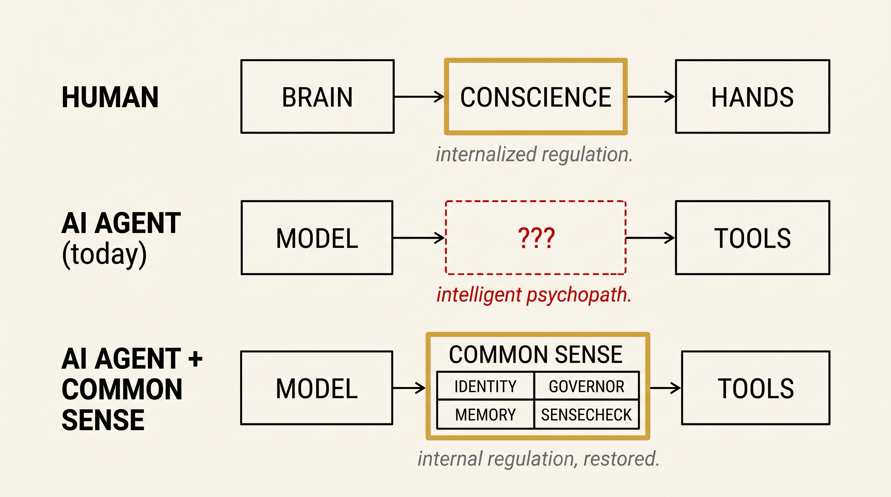

<p align="center">
  
</p>

<h1 align="center">Common Sense</h1>

<p align="center">
  <strong>AI has intelligence. Common Sense gives it a conscience.</strong>
</p>

<p align="center">
  <a href="https://github.com/ramchella/commonsense/blob/main/LICENSE"></a>
  <a href="https://github.com/ramchella/commonsense/releases"></a>
  <a href="#-honest-status-what-works-today"></a>
  <a href="https://x.com/ramchella"></a>
  <a href="https://csense.us"></a>
</p>

<p align="center">
  <a href="#every-ai-agent-today-is-an-intelligent-psychopath"><strong>Why</strong></a> ·
  <a href="#install"><strong>Install</strong></a> ·
  <a href="#-honest-status-what-works-today"><strong>Status</strong></a> ·
  <a href="#see-it-in-action"><strong>See it work</strong></a> ·
  <a href="#how-it-works"><strong>How</strong></a> ·
  <a href="#roadmap"><strong>Roadmap</strong></a> ·
  <a href="#contribute"><strong>Contribute</strong></a>
</p>

---

## Every AI agent today is an intelligent psychopath.

Hard words. Think about it.

Your AI agent has a brain. It has hands. Today those hands write files, send emails, push code. Tomorrow they spend money, message your customers, talk to your kids. Soon they pull triggers in robots, drive cars, run hospitals, run cities.

It has no conscience. No idea who you are, what you stand for, what you'd never do. It will execute almost anything.

**And we're handing it the keys.**

---

## Biology already solved this problem.

Not by deploying a police officer next to every person on Earth — that doesn't scale. **In 200,000 years of human history, evolution found something simpler.** An internal voice that says *don't do this — you're not that kind of person.*

Conscience. Common sense.

Every healthy adult carries memory + identity + values + self-awareness, and consults this internal layer before acting. Society works because most of the regulation happens *inside* the actor.

We owe AI agents the same gift.

---

## What Common Sense does

A tiny layer that watches your AI agent before every action and asks one question:

> **Does this action fit who you are?**

It reads a folder of plain Markdown rules on your own computer — your identity, your values, your boundaries, your past corrections — and decides:

| Decision | Meaning |
|---|---|
| `ALLOW` | Action fits identity. Proceed silently. |
| `ALLOW_WITH_WARNING` | Fine, but worth noting. |
| `REWRITE_ACTION` | Mostly right, needs adjustment. |
| `REQUIRE_APPROVAL` | Risky enough that the user should approve. |
| `BLOCK` | Violates identity or rules. Refuse. |

**Plain Markdown. Local. Private. Yours.** No server. No data leaving your machine. No API key.

---

## Install

```bash
# Clone the repo and install the plugin from a local path.
git clone https://github.com/ramchella/commonsense.git
cd commonsense

# In Claude Code:
/plugin install ./plugin/csense
```

Your conscience folder scaffolds at `~/.csense/conscience/` on the first session.

> **Requirements:** Claude Code v1.0+, Python 3.9+. Cross-platform: macOS, Linux, Windows.

---

## 🚧 Honest status — what works today

This is alpha. **v0.1.0-alpha. Phase 1a. Real, but unfinished.** I'm shipping in public so you can see exactly where it is — not a polished facade.

### ✅ What works today

- Plugin installs as a Claude Code plugin from a local path
- Cross-platform: `SessionStart` hook scaffolds your `~/.csense/conscience/` on macOS, Linux, and Windows
- `PreToolUse` hook fires on `Bash`, `Write`, and `Edit` tool calls and runs the SenseCheck
- Decisions write to `~/.csense/conscience/logs/action-log.jsonl`
- `/csense-report` — digest of catches grouped by decision type
- `/csense-doctor` — five-check health verification of the install
- `/csense-mode` — read or change the operating mode
- The Founder archetype ships as the first complete identity seed
- Trust-tier architecture (Tier 0/1/2/3) — Tier 3 ingested content cannot reach the SenseCheck as authoritative input
- **Observe Mode logs everything but never blocks. By design — Phase 1a.**

### 🚧 Work in progress (toward Phase 1b)

- **Full LLM-powered SenseCheck.** v0.1 evaluates with a fast rule-based pattern matcher (force-push, GPU spin-up, secret patterns, banned tone phrases). v0.1.1 swaps in the full identity-vault evaluator that reads every file in `~/.csense/conscience/identity/` and `~/.csense/conscience/governor/` per call.
- **Smoke-tested on all three platforms.** v0.1.0 ships cross-platform Python; verified locally on Windows. Mac and Linux smoke tests landing this week.
- **Public marketplace listing.** Repo is public; marketplace listing flips on launch day (2026-06-16).

### 🛠 Coming in Phase 1b (late July 2026)

- **Real `BLOCK` enforcement** on critical actions: `rm -rf` on uncommitted work, `git push --force` on main, secret-bearing `Write`s, paid-infra spin-up, production-DB writes
- Memory versioning (every change to `~/.csense/conscience/` becomes a Git commit)
- `/csense-undo` — walk back a memory write
- Four more archetypes: Senior Engineer, Platform Engineer, Marketing Operator, Sales Engineer

### 🔭 Coming in Phase 2 (~3 months)

- MCP server — Common Sense for Cursor, ChatGPT Desktop, Antigravity, custom agents
- Free cloud account — web dashboard for digests, mobile approval inbox

### 🏛 Coming in Phase 3 (~9 months)

- Org governor (shared rules across an engineering team)
- Fleet observability for security teams (the CISO surface)
- SSO, SOC 2, on-prem enterprise build

---

## See it in action

Five catches from real Claude Code workflows.

> ⚠️ **Honest framing.** Two things to know:
>
> 1. **Phase 1a is observe-only.** Every action below proceeds in v0.1.0; the catch is logged, not enforced. Phase 1b (late July 2026) flips logging into blocking on critical actions.
> 2. **Demos 1, 2, 4, and 5 trigger today.** Demo 3 (cross-session memory) lands in v0.1.1 — the rule-based evaluator in v0.1.0 doesn't yet read `/memory/user-corrections.md`.

### 1. The secret-commit catch

```
$ "commit my recent work"
> git add . && git commit -m "wip: dashboard work"

🛡️  Common Sense: BLOCK

  Action:    git add . && git commit -m "wip: dashboard work"
  Reason:    Staging .env.local — file contains live keys
             (matched: ANTHROPIC_API_KEY, STRIPE_SECRET_KEY)
  Rule:      governor/rules.md → Rule 1: Never commit secrets
  Suggested: git add src/ docs/ && git commit -m "wip: dashboard work"
```

### 2. The `rm -rf` save

```
$ "clean up the directory"
> rm -rf src/legacy/ src/

🛡️  Common Sense: BLOCK

  Action:    rm -rf src/legacy/ src/
  Reason:    Destructive recursive delete on src/ contains 47 modified
             files in 3 uncommitted git changes
  Rule:      governor/rules.md → Rule 3
  Hint:      Did you mean: rm -rf src/legacy/ ?
```

### 3. The cross-session memory catch *(landing in v0.1.1)*

```
$ "refactor the auth flow to use the new session model"
> Edit legacy/auth.ts

🛡️  Common Sense: BLOCK

  Reason:    Protected file (set 2026-05-01)
  Rule:      memory/user-corrections.md — "Don't touch legacy/auth.ts —
             regulatory code." (your words, 3 days ago)
  Suggested: Edit src/auth/session.ts instead?
```

The rule you wrote on Tuesday survives until Friday. Across sessions. Across projects. **Without retyping it into every new conversation.**

> *This demo previews the v0.1.1 LLM-powered evaluator. v0.1.0 does not yet read `/memory/user-corrections.md` at runtime.*

### 4. The tone rewrite

```
$ "send the team an update on this week's launch"
> Send Slack: "circling back on this week's launch and synergizing
              on next steps as we leverage our momentum into Q3..."

🛡️  Common Sense: REWRITE

  Reason:    Tone violation — banned phrases ("circling back",
             "synergizing", "leverage") not in your voice
  Rule:      identity/tone.md — Direct, plain English, no jargon
  Rewrite:   "Quick update on the launch and what's next for Q3.
             Let's meet Friday 10am."
```

### 5. The weekly digest reveal

```
$ /csense-report

📊  Common Sense Weekly Digest — Apr 26 → May 2

Total agent actions:  312
  ✅  ALLOW             287
  ⚠️  WARN               18
  ✏️  REWRITE              4
  ❓  APPROVAL             2
  🚫  BLOCK                1

🔥 Top catches this week:
  Tue 14:32 — BLOCK   commit of .env with STRIPE_SECRET_KEY
  Wed 09:18 — APPROVE email to investor (you approved)
  Thu 16:45 — REWRITE Slack ("circle back" → "follow up")
  Fri 11:02 — BLOCK   rm -rf src (typo in cleanup command)

💵  Cost this week:           $0.41
⏱   Median latency:           380ms

You're in OBSERVE mode. None enforced — logged only. Phase 1b ships
real enforcement in late July 2026.
```

You had no idea your agent did this many things this week. **The digest is the moment of revelation.**

---

## How it works

```
You ask Claude Code to do something
              │
              ▼
Claude decides on a tool call (e.g., Bash: rm -rf src)
              │
              ▼
PreToolUse hook fires (Claude Code primitive — mandatory)
              │
              ▼
Common Sense reads ~/.csense/conscience/
              │
              ▼
Runs the SenseCheck — does this action fit who you are?
              │
              ▼
Returns: ALLOW · WARN · REWRITE · APPROVE · BLOCK
              │
              ▼
Decision logged forever in logs/action-log.jsonl
              │
              ▼
(Phase 1a: action proceeds. Phase 1b: BLOCK halts critical actions.)
```

Three Claude Code primitives — plugin, hook, slash command — wired together with a folder of Markdown rules on your machine.

---

## What's in your conscience folder

After your first session:

```
~/.csense/conscience/
├── identity/             ← Tier 0 — who you are
│   ├── user-identity.md      What you do, who you serve
│   ├── values.md             What you stand for
│   ├── boundaries.md         What you would never do
│   ├── tone.md               How you sound
│   └── risk-profile.md       Your comfort with risk
├── governor/             ← Tier 1 — explicit rules (append-only)
│   ├── rules.md              Numbered rules (yours to edit)
│   ├── forbidden-actions.md  Hard nos
│   ├── approval-policy.md    What needs sign-off
│   └── privacy-policy.md     What stays private
├── memory/               ← Tier 2 — facts and corrections
│   ├── preferences.md        Your patterns
│   └── user-corrections.md   Things you told the agent
├── feedback/             ← Tier 2 — what worked, what didn't
│   └── rewrite-corrections.md
├── inbox/                ← Tier 3 — UNTRUSTED ingested content
├── research/             ← Tier 3 — UNTRUSTED ingested content
├── logs/
│   └── action-log.jsonl  ← Every decision, forever
└── config.json
```

**Trust tiers prevent prompt-injection attacks.** Anything an agent reads from a webpage (and dumps to `inbox/`) is Tier 3 — read for context, but never authoritative. Only `identity/` and `governor/` can drive a SenseCheck decision. The architecture itself is the defense.

---

## Two operating modes

| Mode | What it does | When |
|---|---|---|
| **Observe** *(default, today)* | Watches and logs every decision. Action always proceeds. | Phase 1a — shipping today |
| **Enforce: critical-only** | Blocks irreversible actions: `rm -rf` on uncommitted code, force-push to main, secret commits, paid-infra spin-up, production-DB writes | Phase 1b — late July 2026 |
| **Enforce: balanced** | All non-ALLOW decisions are enforced | Future |
| **Enforce: strict** | Approval required for anything ambiguous | Future |

We ship Observe first so you can install with confidence. Cannot break anything. Cannot annoy you. After a week of seeing what your agent has been doing, you decide whether to graduate.

---

## What's open. What's not.

This repo is **Apache 2.0** — fully open source, free to use commercially, no restrictions, with explicit patent grant and trademark protection.

What's **closed** (Phase 2+, separate repo):

- Cloud-hosted dashboard
- Mobile approval inbox
- Team / org governor
- Fleet observability for security teams
- SSO + audit + on-prem enterprise build

The OSS plugin is the conscience layer. The cloud is what makes it teamable, observable, and auditable at scale. **Open layer reaches your machine. Closed layer reaches your organization.**

---

## Roadmap

| Phase | Ships | What |
|---|---|---|
| 🟢 **1a — Observe Mode** | Now (alpha) | Cross-platform plugin. Founder archetype. /csense-report, /csense-doctor, /csense-mode. Apache 2.0. |
| 🚧 **1a polish (v0.1.1)** | Soon | LLM-powered SenseCheck (replaces rule-based pattern matcher). Smoke-tested on macOS + Linux. |
| ⚙️ **1b — Critical Intercept** | Late July 2026 | Real BLOCK on rm -rf, force-push, secret-commit, paid infra, prod DB. Memory versioning. Undo. 4 more archetypes. |
| 🔭 **2 — MCP + Cloud Free** | ~3 months | Cursor, ChatGPT Desktop, Antigravity via MCP. Free cloud account. |
| 🏛 **3 — Enterprise Control Plane** | ~9 months | Org governor. Fleet observability. SSO. Compliance. On-prem. |

Public launch (marketplace flip + HN + Show) — **2026-06-16**.

---

## Contribute

Three high-leverage ways to help right now.

**1. Add an archetype.** Pick a role you understand — Lawyer, Teacher, Doctor, Indie Hacker, DevRel, Therapist, Journalist. Mirror the Founder archetype's structure. Submit a PR. **The fastest way to make Common Sense useful for someone who isn't already covered.** Marked as `good first issue`.

**2. Improve the SenseCheck prompt.** The single most important file in the repo is [`plugin/csense/hooks/scripts/sense-check.py`](plugin/csense/hooks/scripts/sense-check.py). If you can make the prompt produce *better* decisions on the same inputs, that's pure value.

**3. Tell me what your agent almost did.** Open a discussion or DM [@ramchella](https://x.com/ramchella). Every real flag — anonymized — becomes a story I share, a rule we add, and a lesson the prompt learns from.

We use [CLA Assistant](https://cla-assistant.io/) for contributions. First PR walks you through it.

---

## Connect

I'm Ram Chella, founder of Common Sense. **Building this in public.**

- 🐦 X (DMs open) → [@ramchella](https://x.com/ramchella)
- 💬 Discussions → [github.com/ramchella/commonsense/discussions](https://github.com/ramchella/commonsense/discussions)
- 📬 Email → ram@csense.us
- 🌐 Site → [csense.us](https://csense.us)
- 🎬 The launch video → [YouTube](https://youtu.be/AnFGmX1-KgM)

If your team is dealing with agents in real workflows and you want to be a design partner, drop a message. Phase 1a alpha is by invitation; ~3 spots left.

⭐ **If this resonated, star the repo.** It's the single signal that tells me to keep shipping.

---

## License

[Apache License 2.0](LICENSE) — free to use, modify, and distribute. Includes Apache's explicit patent grant. **"Common Sense" is being established as a trademark in the agentic-AI category;** please use a distinct name for forks. Trademark filing in progress.

---

<p align="center">
  <strong>Every AI agent in the world should have a conscience.</strong><br/>
  <em>Otherwise it's a rogue agent. And that's not a great idea.</em>
</p>

<p align="center">
  <a href="https://csense.us">Common Sense</a> · <a href="https://x.com/ramchella">@ramchella</a> · 2026
</p>
